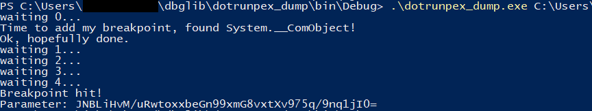

# Dbglib



`dbglib` is a .NET debugging automation library, written at CERT Polska. The goal was to create a simple reusable utility for automated dynamic extraction of malware.

`dotrunpex_dump` is a simple example and application of `dbglib` - a simple dynamic unpacker for dotrunpex packer.

It is a heavily rewritten fork of Mindbg (author's blog: http://lowleveldesign.wordpress.com), which in turn was inspired by mdbg.

### Basic usage

The easiest way to use dbglib is to clone the repository and edit the code
or add a new project for your use. You might also download the release and use the DLL directly.

To do anything useful with the library, you need to subclass ManagedCallback and provide your own implementation of desired callbacks. The simplest
possible program will look like this:

```csharp
public class TinyCallback : ManagedCallback {
    public override void LoadModule(ICorDebugAppDomain pAppDomain, ICorDebugModule pModule) {
        Console.WriteLine("Loading a module {0}", pModule.GetName());
        base.LoadModule(pAppDomain, pModule);
    }
}

class Program {
    static void Main(string[] args) {
        var callback = new TinyCallback();
        DebuggerManager.Create(callback).CreateProcess(args[0]);
        Thread.Sleep(10000);
    }
}
```

This will create a new process (with filename from `args[0]`), debug it,
and log all loaded modules to the stdout:

```
Loading a module Anonymously Hosted DynamicMethods Assembly
PS C:\Users\xxx\dbglib\dotrunpex_dump\bin\Debug> .\dotrunpex_dump.exe C:\Users\xxx\AppData\Roaming\svchost.exe
Loading a module C:\Windows\Microsoft.Net\assembly\GAC_64\mscorlib\v4.0_4.0.0.0__b77a5c561934e089\mscorlib.dll
Loading a module C:\Users\xxx\AppData\Roaming\svchost.exe
Loading a module C:\Windows\Microsoft.Net\assembly\GAC_MSIL\System\v4.0_4.0.0.0__b77a5c561934e089\System.dll
Loading a module Fish
Loading a module C:\Windows\Microsoft.Net\assembly\GAC_MSIL\System.Core\v4.0_4.0.0.0__b77a5c561934e089\System.Core.dll
Loading a module C:\Windows\Microsoft.Net\assembly\GAC_MSIL\System.Windows.Forms\v4.0_4.0.0.0__b77a5c561934e089\System.Windows.Forms.dll
Loading a module C:\Windows\Microsoft.Net\assembly\GAC_MSIL\System.Drawing\v4.0_4.0.0.0__b03f5f7f11d50a3a\System.Drawing.dll
Loading a module Anonymously Hosted DynamicMethods Assembly
```

You can override any method supported by [ICorDebugManagedCallback](https://learn.microsoft.com/en-us/dotnet/framework/unmanaged-api/debugging/icordebugmanagedcallback-interface).

For a more complex example, see the [dotrunpex_dump](./dotrunpex_dump/Program.cs) project.

One important caveat - always call `base.OverridenFunction()` at the end of your function, because otherwise program will stay on hold forever.
Alternatively, just call `pAppDomain.Continue(0);` yourself.

### Non-features

Many obvious features are missing, for example:

* Reading objects of type other than string is not supported ([implementation reference](https://devhawk.net/blog/2009/3/31/writing-an-ironpython-debugger-displaying-values))
* Most symbols (other than arguments) are not supported, for example it's not possible to enumerate local variables easily ([implementation reference](https://devhawk.net/2009/03/25/writing-an-ironpython-debugger-getting-local-variables/))
* You can't use this library from PowerShell (multiple reasons, but in short - COM interop issues). It's possible to work around this, but it's not a priority for us.

This project was created to solve a specific problem (and it did).
In general we won't implement new features, unless we need them for something. But if you use dbglib in your research and add a feature,
feel free to create a Pull Request.

### Notes about the library design

This library tries to be **lightweight** and to simplify
automation **without unnecessary abstraction layers**.
Because of this, most of the API is a thin wrapper over the COM objects.
A lot of the helpers are implemented as C#'s Extension Methods - a way to
use external methods on objects in an elegant way.

For example, let's take a look this code:

```csharp
public override void Breakpoint(..., ICorDebugThread pThread, ...) {
    Console.WriteLine("Breakpoint hit!");
    ICorDebugValue value = pThread.GetActiveFrame().GetILFrame().GetArgument(0);
    string keyCandidate = value.AsString().GetStringValue();
    Console.WriteLine("Parameter: {0}", keyCandidate);
    ...
}
```

[ICorDebugThread](https://learn.microsoft.com/en-us/dotnet/api/microsoft.visualstudio.cordebuginterop.icordebugthread?view=visualstudiosdk-2022) is a COM interface that we have bindings to. The bindings are implemented in the [ICorDebugWrappers.cs](./dbglib/NativeApi/ICorDebugWrappers.cs) file.

Unfortunately, the native bindings are a bit awkward to use (they use pointers and out parameters instead of returning results directly),
so we also have a "nice" wrappers implemented in [Extension.cs](./dbglib/Extensions.cs) file. They make the library much more pleasant to use.
For example, the native version of the first line in the above function is:

```csharp
ICorDebugFrame frame;
pThread.GetActiveFrame(out frame);
ICorDebugILFrame ilframe = frame as ICorDebugILFrame;
ICorDebugValue value;
ilframe.GetArgument(0, out value);
```

We believe having static methods acting on native interfaces is a simpler
and more "hackable" design than wrapping everything in our own clasess (and inenvitably missing some important wrappers).
If anything is missing in our library, users can always fall back to
the native COM methods directly (with the bindings we provide).
